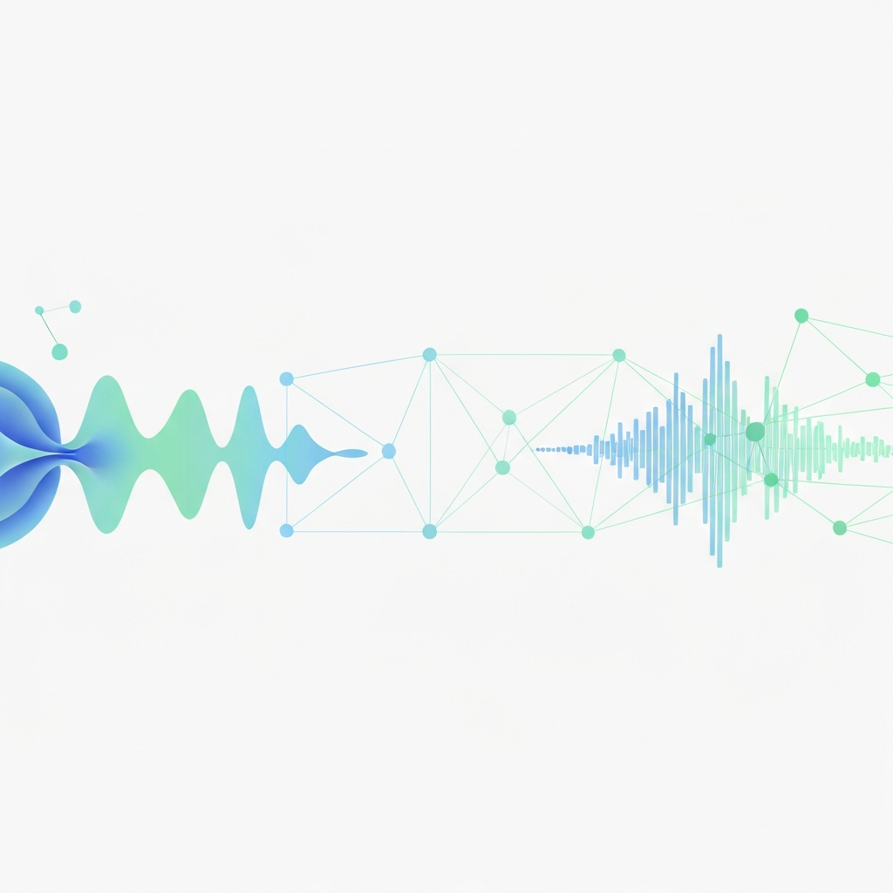
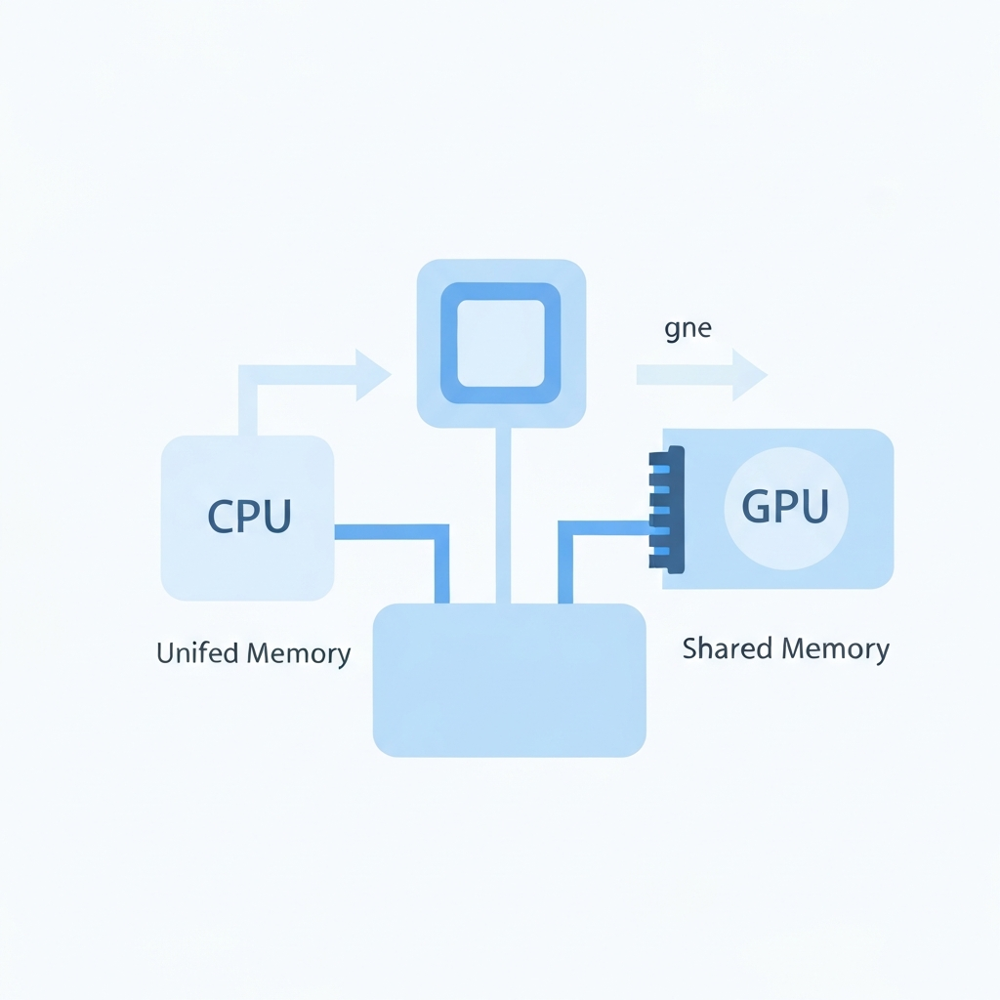
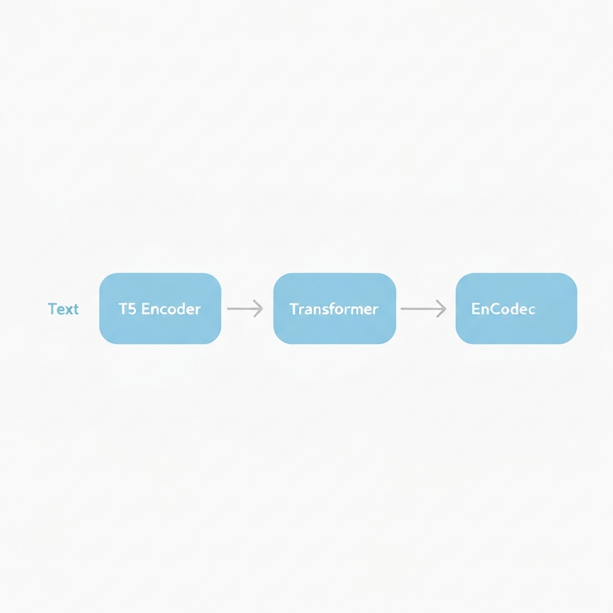
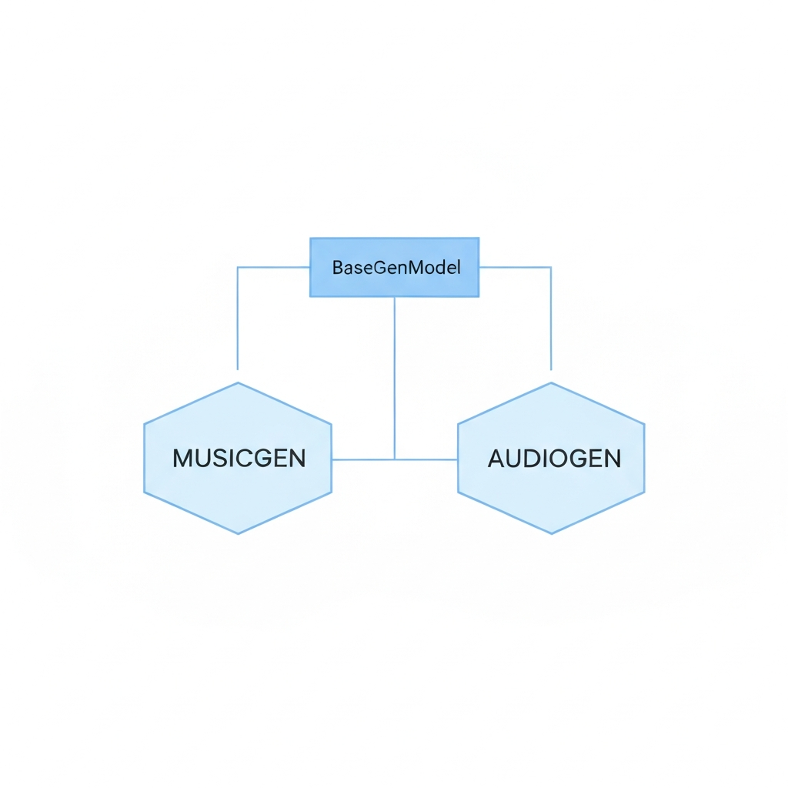

# I Ported AudioGen to Apple Silicon — Here's Everything I Learned

*How we built mlx-audiocraft: the first package that runs both MusicGen and AudioGen (text-to-sound-effects) on M-series Macs using MLX.*



---

## Why I built this

I was building a video production pipeline on my M4 Mac — AI-narrated videos, background music, the works. The music generation side was solved: ACE-Step and a couple of MLX-based MusicGen ports exist. But every time I needed a sound effect — a keyboard click, ambient office noise, a notification chime — I hit a wall.

**AudioGen** is Meta's model for text-to-sound-effects. It's part of their AudioCraft library and it's genuinely good. The problem: AudioCraft as a pip package is completely broken on Apple Silicon in 2026.

Try it yourself:

```bash
pip install audiocraft
```

You get this cascade of failures:

1. `av==11.0.0` tries to build against your system ffmpeg. ffmpeg 7.x renamed `AV_OPT_TYPE_CHANNEL_LAYOUT` to `AV_OPT_TYPE_CHLAYOUT`. The build explodes with 40 lines of C errors.
2. Even if you pin ffmpeg, `xformers` won't build because Apple clang doesn't support `-fopenmp`.
3. Even if you work around that, the whole thing runs on CPU at 0.03x realtime — painful for a 30-second audio clip.

So the choices were: run a Linux VM, rent a cloud GPU, or port it to MLX properly.

I chose the third option. This post is the full story of how that went.

---

## What is MLX and why does it matter for this



MLX is Apple's own machine learning framework, released in late 2023. The key thing to understand is the memory model.

On a normal computer, the CPU has its RAM and the GPU has its VRAM. Copying data between them takes time — this is why PyTorch has `.to("cuda")` and `.to("cpu")` calls everywhere. Every time you move a tensor between CPU and GPU you pay a transfer cost.

On Apple Silicon, **there is no separate VRAM**. The CPU, GPU, and Neural Engine all share the same physical memory pool. An array in MLX is already in a place where every compute unit can access it directly, with zero copying overhead.

MLX is designed from scratch for this architecture. It's lazy by default (computations don't happen until you `mx.eval()`), it has automatic differentiation, and it has Python bindings that feel a lot like NumPy crossed with PyTorch.

For our use case this means: once weights are loaded into MLX, every forward pass runs on the GPU with no transfer overhead. No `.to()` calls. No "device" concept at all.

---

## The AudioCraft architecture (what we're actually porting)

Before diving into the code, it's worth understanding what AudioCraft actually *is* under the hood, because this shapes everything about the port.

AudioCraft has two models you've probably heard of:

- **MusicGen** — generates music from text prompts
- **AudioGen** — generates sound effects and environmental audio from text prompts

Here's the surprising thing: **they use the exact same architecture**. Same transformer language model. Same audio codec. The only differences are what they were trained on and a few config values.

The pipeline for both looks like this:



```
Your text prompt
      │
      ▼
  T5 Encoder              ← reads your text, outputs a sequence of embeddings
      │                      runs on CPU (PyTorch, ~3s startup then cached)
      ▼
  Transformer LM           ← auto-regressive token generation
      │                      conditioned on T5 embeddings via cross-attention
      │                      runs on MLX (Apple GPU)
      ▼
  EnCodec Decoder          ← turns discrete tokens back into a waveform
                             runs on MLX (Apple GPU)
```

**T5** is Google's text encoder. It reads your prompt and produces a dense numerical representation of what you asked for. This runs in PyTorch on CPU — there's no MLX T5 port yet and it's not the bottleneck anyway.

**The Transformer LM** is where the heavy lifting happens. It's an auto-regressive decoder that predicts audio tokens one step at a time. Each step is conditioned on: (a) all previously generated tokens, and (b) the T5 embeddings of your prompt via cross-attention. This is what runs on the MLX GPU and where the speedup matters.

**EnCodec** is Meta's neural audio codec. Think of it like a lossy audio compressor, but the "compression" and "decompression" are learned neural networks. The encoder turns a waveform into a sequence of discrete integer tokens (like a very compressed audio representation). The decoder turns those tokens back into audio. The LM generates the tokens; EnCodec decodes them.

### AudioGen vs MusicGen: what actually differs

| | MusicGen | AudioGen |
|--|----------|----------|
| Sample rate | 32 kHz | 16 kHz |
| Codebooks | 4–8 | 4 |
| Conditioning | Text + optional melody | Text only |
| Training data | Music | Sound effects & environments |
| Default clip length | 30s | 5–10s |
| CFG coefficient | 3.0 | 3.0 |

That's it. The transformer architecture is identical. The EnCodec architecture is identical. The only differences are the trained weights and a few config values.

This observation is what made the port tractable.

---

## The existing work we built on

Before writing a single line, I looked for what already existed.

**[musicgen-mlx](https://github.com/andrade0/musicgen-mlx)** by Andrade Olivier is a solid MLX port of MusicGen. It has:
- A full MLX implementation of the transformer LM
- MLX EnCodec implementation
- HuggingFace weight loading with PyTorch→MLX conversion
- A `BaseGenModel` class with text conditioning and sliding-window generation

This is genuinely good engineering. The transformer is cleanly ported. The weight conversion handles the PyTorch→MLX tensor format differences. The sliding window logic handles clips longer than the model's native `max_duration`.

What it **didn't** have was AudioGen. When I looked at the code, I understood why: the author correctly implemented MusicGen's melody conditioning. AudioGen doesn't have melody conditioning — it's simpler. But extending the codebase to add a new model class wasn't on their roadmap.

So the plan became: **fork musicgen-mlx, add AudioGen, publish as a new package with proper attribution.**

---

## How we ported AudioGen: the actual code



Here's where it gets interesting.

I started by reading Meta's original AudioGen code to understand what overrides it makes on top of the base model. From the [AudioCraft source](https://github.com/facebookresearch/audiocraft):

```python
# Meta's original audiogen.py (simplified)
class AudioGen(BaseGenModel):
    def get_pretrained(name="facebook/audiogen-medium"):
        lm = get_lm_model(name)
        compression_model = get_compression_model(name)
        return AudioGen(name, compression_model, lm)
    
    def set_generation_params(self, duration=5.0, cfg_coef=3.0, ...):
        # Same params as MusicGen, different defaults
        ...
    
    # _prepare_tokens_and_attributes: NOT overridden
    # _generate_tokens: NOT overridden
    # generate(): NOT overridden
```

The key insight: **AudioGen overrides almost nothing.** The base class `BaseGenModel` already implements:

- `_prepare_tokens_and_attributes()` — text-only conditioning, which is exactly what AudioGen uses
- `_generate_tokens()` — auto-regressive generation with sliding-window for long clips
- `generate()`, `generate_continuation()`, `generate_unconditional()`

MusicGen *does* override `_prepare_tokens_and_attributes` to add melody/chroma conditioning. AudioGen doesn't need that. It just needs:

1. A `get_pretrained()` that points at AudioGen's HuggingFace checkpoints
2. A `set_generation_params()` with SFX-appropriate defaults (5s duration, not 30s)

Here's the complete `audiogen.py` we wrote:

```python
class AudioGen(BaseGenModel):
    """AudioGen: text-to-sound-effects on Apple Silicon via MLX."""

    def __init__(self, name, compression_model, lm, max_duration=None):
        super().__init__(name, compression_model, lm, max_duration)
        self.set_generation_params(duration=5)  # SFX default: 5s, not 30s

    @staticmethod
    def get_pretrained(name="facebook/audiogen-medium") -> "AudioGen":
        from .loaders import load_compression_model, load_lm_model
        
        lm = load_lm_model(name)
        compression_model = load_compression_model(name)
        
        # Pull max_duration from the embedded experiment config
        max_duration = None
        if hasattr(lm, 'cfg') and hasattr(lm.cfg, 'dataset'):
            max_duration = getattr(lm.cfg.dataset, 'segment_duration', None)
        
        return AudioGen(name, compression_model, lm, max_duration)

    def set_generation_params(self, use_sampling=True, top_k=250, top_p=0.0,
                               temperature=1.0, duration=5.0, cfg_coef=3.0,
                               two_step_cfg=False, extend_stride=3.0):
        assert extend_stride < self.max_duration
        self.extend_stride = extend_stride
        self.duration = duration
        self.generation_params = {
            "use_sampling": use_sampling,
            "temp": temperature,
            "top_k": top_k,
            "top_p": top_p,
            "cfg_coef": cfg_coef,
            "two_step_cfg": two_step_cfg,
            "cfg_coef_beta": None,
        }

    # _prepare_tokens_and_attributes and _generate_tokens: inherited from BaseGenModel
    # generate(), generate_continuation(), generate_unconditional(): also inherited
```

That's the entire file — about 90 lines including docstrings. Everything else is inherited.

The loaders (`load_lm_model`, `load_compression_model`) already worked for MusicGen checkpoints, and they work identically for AudioGen checkpoints because the file format is identical: `state_dict.bin` for the LM and `compression_state_dict.bin` for EnCodec. HuggingFace does the downloading and caching automatically.

### The weight loading pipeline

One thing worth explaining is how weights move from HuggingFace into MLX, because it's non-trivial.

The HuggingFace checkpoints are standard PyTorch `.bin` files. MLX arrays and PyTorch tensors are different in a few ways: PyTorch is row-major (C order), MLX is also row-major but has different internal representations for certain layer types. There are also naming convention differences — PyTorch's `nn.Linear` stores weights as `(out_features, in_features)`, some MLX layers expect transposed weights.

The `loaders.py` handles this with a conversion step:

```python
pkg = torch.load(hf_hub_download(repo_id, 'state_dict.bin'), map_location='cpu')
cfg = OmegaConf.create(pkg['xp.cfg'])          # embedded experiment config
model = builders.get_lm_model(cfg)              # build MLX model from config
state_dict = convert_lm_weights(pkg['best_state'])  # numpy weight conversion
_load_weights_into_model(model, state_dict)     # load numpy → mx.array
```

The `convert_lm_weights` function handles transposing linear layer weights where needed, renaming keys to match MLX conventions, and converting PyTorch tensors to numpy arrays (which then become `mx.array`).

A subtlety: the checkpoint also contains T5 conditioner weights. These get split out during loading:

```python
for key, value in converted.items():
    if key.startswith('condition_provider.conditioners.'):
        cond_weights[key] = value   # T5 output projection — stays in MLX
    else:
        lm_weights[key] = value     # LM weights — loaded into MLX transformer
```

The T5 backbone itself is loaded separately by HuggingFace `transformers` directly from `google-t5/t5-base`, which is a separate download. This is fine because T5 runs in PyTorch on CPU — it's only invoked once per `generate()` call to encode the text, and after the first call it's cached by the OS.

---

## The generation loop in detail

Let me walk through what actually happens when you call `model.generate(["dog barking in a park"])`.

**Step 1: Text encoding (CPU, PyTorch)**

The T5 encoder tokenizes your prompt and runs a forward pass, outputting a sequence of 512-dimensional embeddings — one per token in the prompt. For "dog barking in a park" that's about 7 tokens → a `[1, 7, 512]` tensor.

**Step 2: Token generation (GPU, MLX)**

The transformer LM generates audio tokens auto-regressively. For 5 seconds of audio at AudioGen's 50 fps frame rate, that's 250 time steps. At each step:

- The LM takes all previously generated tokens + the T5 embeddings as input
- Cross-attention layers allow each token to attend to the T5 embeddings
- The output is a probability distribution over the codebook vocabulary
- We sample from this distribution (top-k sampling with k=250 by default)

Classifier-free guidance (CFG) means the LM actually runs twice per step: once with the text conditioning ("dog barking") and once unconditionally (empty text). The final logits are a linear interpolation: `logits = uncond + cfg_coef * (cond - uncond)`. This pushes the generation toward the text description. `cfg_coef=3.0` means "3x push toward the conditioned direction."

**Step 3: Audio decoding (GPU, MLX)**

The generated token sequence `[batch, codebooks, time_steps]` is fed to the EnCodec decoder. This is a convolutional neural network that upsamples the discrete tokens back into a continuous waveform at 16 kHz. For 5 seconds at 16 kHz, the output is `[1, 1, 80000]` — batch × channels × samples.

**Step 4: Save**

We convert the MLX array to numpy, transpose from `[channels, samples]` to `[samples, channels]`, and write with `soundfile`.

### Sliding window for long audio

AudioGen-medium was trained on 10-second clips. What if you want 30 seconds?

`BaseGenModel._generate_tokens` handles this with a sliding window:

```
Generate tokens 0 → max_duration
Take the last extend_stride seconds as the new "prompt"
Generate tokens from that context → max_duration again
Repeat until we have enough tokens
Concatenate and return
```

`extend_stride=3.0` means we overlap by 3 seconds between windows, giving the model enough context to maintain continuity.

---

## Getting the packaging right

One thing I wanted to do from the start was make this a proper package that anyone could install with a single command. A few things went into that:

### pyproject.toml

Modern Python packaging uses `pyproject.toml`. The key things we needed:

```toml
[project]
name = "mlx-audiocraft"
version = "0.1.0"
requires-python = ">=3.10"
dependencies = [
    "mlx>=0.17",
    "numpy",
    "torch",          # CPU-only, for T5 text encoder
    "transformers",
    "huggingface-hub",
    "omegaconf",
    "soundfile",
    "tqdm",
    "einops",
]

[project.scripts]
musicgen-mlx = "mlx_audiocraft.cli:musicgen_main"
audiogen-mlx = "mlx_audiocraft.cli:audiogen_main"
```

The `torch` dependency is CPU-only here — only used for T5 text encoding. You don't need CUDA, MPS, or any GPU-side PyTorch.

### Credential-free PyPI publishing via OIDC

Instead of storing a PyPI API token as a GitHub secret, we use GitHub Actions OIDC trusted publishing. The workflow triggers on GitHub releases and uses short-lived OIDC tokens that PyPI and GitHub exchange automatically — no credentials stored anywhere:

```yaml
on:
  release:
    types: [published]

jobs:
  publish:
    environment: pypi
    permissions:
      id-token: write  # OIDC — no password needed
    steps:
      - uses: actions/checkout@v4
      - run: pip install build && python -m build
      - uses: pypa/gh-action-pypi-publish@release/v1
```

---

## Results


Here's what actually running this feels like on an M4 Max with 64 GB unified memory.

### First run (downloading models)

```
Loading facebook/audiogen-medium...
  Fetching compression_state_dict.bin (1.4 GB)... ████████ 100%
  Fetching state_dict.bin (2.2 GB)... ████████ 100%
  Fetching t5-base weights... ████████ 100%
Model ready (47.3s)
```

Everything lands in `~/.cache/huggingface/` and subsequent loads are instant (~3s).

### Generation speed

| Model | Prompt duration | Wall time | Realtime ratio |
|-------|----------------|-----------|----------------|
| `audiogen-medium` | 5s SFX | ~29s | 0.17x |
| `musicgen-small` | 10s music | ~15s | 0.68x |
| `musicgen-medium` | 10s music | ~17s | 0.60x |
| `musicgen-large` | 10s music | ~35s | 0.29x |

A realtime ratio of 0.17x means generating 5 seconds of audio takes 29 seconds. That sounds slow, but compare it to CPU-only AudioCraft where a 5-second clip takes several minutes. The MLX port is running on the GPU — the bottleneck is the auto-regressive generation loop itself (250 sequential transformer forward passes), not the hardware.

For context: this is running on a single consumer laptop, offline, with no API calls, no cloud costs, and no server to manage.

### Audio quality

Honestly better than I expected. AudioGen is genuinely impressive for sound effects:

- **"keyboard typing on a mechanical keyboard, quiet office"** → sounds like the real thing. You can hear the subtle variation between keystrokes.
- **"crowd applause, conference room"** → realistic room reverb, natural crowd dynamics.
- **"rain on a metal roof, distant thunder"** → the thunder timing and reverb are convincing.

MusicGen through this port sounds identical to what you'd get from ACE-Step or the original Meta demo. The MLX execution doesn't affect output quality — we're running the exact same weights with the same arithmetic, just on different hardware.

One thing I noticed: **musicgen-small is surprisingly good for the size**. At 300M parameters and ~1x realtime, it's the sweet spot for quick prototyping. musicgen-large gets you noticeably better compositional structure and less repetition, but you're waiting 35 seconds per 10-second clip.

---

## What I learned

**The inheritance insight was the unlock.** Once I understood that `BaseGenModel` already implemented everything AudioGen needed, the port went from "big ML project" to "add one file and update two imports." This is good library design by Meta — the base class handles the general case, and subclasses only override what's different.

**MLX weight loading is the fiddly part.** The actual transformer math is straightforward to translate from PyTorch to MLX — the operations are nearly identical. But getting 847 weight tensors to load into the right places with the right shapes and transpositions took careful reading of the conversion code. The `loaders.py` is the most complex file in the codebase.

**Packaging matters more than the code.** Writing `audiogen.py` took an afternoon. Getting the package to `pip install` cleanly, with proper entry points, pyproject.toml, OIDC publishing, and a README that explains things clearly — that took about as long again. If you want people to actually use your open source work, the packaging is as important as the implementation.

**Apple Silicon is a real ML platform now.** M4 Max at 0.17x realtime for a 1.5B-parameter model, offline, no GPU rental, on a laptop. It's not H100 speed, but for inference workloads that don't need real-time generation it's more than good enough. And the experience of having everything in unified memory — no `.to("cuda")`, no out-of-memory errors, no device management — is genuinely nicer to work with.

---

## What's next

- **AudioGen stereo** — the medium model is mono (16 kHz, 1 channel). Stereo AudioGen would be great for immersive video work.
- **Streaming generation** — currently we wait for the whole clip before returning. Exposing a streaming API would let you start playing audio while generation continues.
- **Fine-tuning** — MLX supports training, not just inference. Fine-tuning AudioGen on a custom sound effects library should be possible with the current architecture.
- **Real benchmark script** — `benchmarks/run_benchmarks.py` runs a reproducible benchmark and saves results to JSON. If you run it on your machine, please open a PR with your results.

---

## Installation

```bash
pip install mlx-audiocraft
```

**Requirements:** macOS 13+, Apple Silicon (M1/M2/M3/M4), Python 3.10+

```bash
# Sound effects
audiogen-mlx "keyboard typing, office ambience" -d 5 -o sfx.wav

# Music
musicgen-mlx "upbeat cinematic tech promo, piano, 120 BPM, no vocals" -d 30 -o music.wav
```

Or in Python:

```python
from mlx_audiocraft import AudioGen, MusicGen

# Sound effects
model = AudioGen.get_pretrained("facebook/audiogen-medium")
model.set_generation_params(duration=5)
wav = model.generate(["rain on a window, distant thunder"])

# Music
model = MusicGen.get_pretrained("facebook/musicgen-medium")
model.set_generation_params(duration=30)
wav = model.generate(["calm lo-fi beat, soft piano, vinyl crackle"])
```

Source: **[github.com/theashishmaurya/mlx-audiocraft](https://github.com/theashishmaurya/mlx-audiocraft)**

---

## Attribution

The MusicGen MLX engine — the transformer, EnCodec, conditioners, weight loading, and `BaseGenModel` — is based on **[musicgen-mlx](https://github.com/andrade0/musicgen-mlx)** by Andrade Olivier. This was excellent, well-structured work and saved weeks of effort. Go star that repo.

The original AudioCraft library (MusicGen, AudioGen, EnCodec) is by **[Meta AI Research](https://github.com/facebookresearch/audiocraft)**. The pre-trained model weights (`facebook/audiogen-medium`, `facebook/musicgen-*`) are released under [CC-BY-NC 4.0](https://creativecommons.org/licenses/by-nc/4.0/) — free for research and personal use, not commercial use.

The AudioGen MLX port (`mlx_audiocraft/models/audiogen.py`) is original work in this repository, released under MIT.

---

*Built by [Ashish Maurya](https://github.com/theashishmaurya). Questions or contributions welcome — open an issue or PR.*
